# npm publish (Bitwarden OTP)

Publish to npmjs.com without the login and OTP grind. Auth is a 90 day
granular token in `~/.npmrc`; the mandatory 2FA code comes from Bitwarden
and rides `npm publish --otp=`. Matt unlocks Bitwarden once per work
session by typing his master password into a Terminal window; after that,
publishing is hands free.

Why: npm revoked classic tokens (Dec 2025) and `npm login` now hands out a
2 hour session. A granular token lasts up to 90 days, but 2FA on write is
still mandatory, so every publish needs an OTP; this skill fetches it.

## Config (Matt's machine)

| Thing | Value |
|-------|-------|
| `<skill>` | `~/.claude/skills/matt:npm-publish` |
| `<item>`: Bitwarden item id | `2c8cbfc9-eee7-4210-9e79-af4101431198` (`www.npmjs.com (m4ttheweric)`) |
| `<session file>` | `~/.cache/npm-bw.session` (session key, mode 600) |
| Registry token | `//registry.npmjs.org/:_authToken=` line in `~/.npmrc` |
| npm user | `m4ttheweric` |

If the item id ever changes, Matt finds it with the `!` prefix (only
`bw get totp *` is allowlisted, so a broader `bw list` from the agent gets
blocked):
`bw list items --search npm --session "$(cat ~/.cache/npm-bw.session)" | jq -r '.[] | "\(.id) | \(.name)"'`

## The flow

Follow this graph. A move it does not show is a question for Matt through
AskUserQuestion, never a judgment call.

```dot
digraph npm_publish {
    rankdir=TB;

    "Trigger: a package is ready to publish to npmjs.com" [shape=ellipse];
    "Confirm the package directory and version" [shape=box];
    "npm view <name>@<version> version --prefer-online" [shape=plaintext];
    "npm view printed <version>?" [shape=diamond];
    "bw get totp <item> --session <session file> (probe)" [shape=plaintext];
    "Probe printed UNLOCKED?" [shape=diamond];
    "Unlock windows opened = 2?" [shape=diamond];
    "bash <skill>/scripts/bw-unlock.sh" [shape=plaintext];
    "bw-unlock.sh opened the window?" [shape=diamond];
    "Tell Matt to type the master password in the Terminal window" [shape=box];
    "bash <skill>/scripts/wait-for-unlock.sh (background, 5 minute cap)" [shape=plaintext];
    "wait-for-unlock.sh printed?" [shape=diamond];
    "STOP: the master password stays out of this session; ask with AskUserQuestion" [shape=octagon style=filled fillcolor=red fontcolor=white];
    "Locked-vault gate asked = 2?" [shape=diamond];
    "AskUserQuestion {questions: [the vault is still locked]}" [shape=plaintext];
    "Locked-vault answer?" [shape=diamond];
    "npm publish --otp=<fresh bw totp> <flags>" [shape=plaintext];
    "npm publish result?" [shape=diamond];
    "EOTP retries = 1?" [shape=diamond];
    "STOP: a fresh npm token comes from Matt; ask with AskUserQuestion" [shape=octagon style=filled fillcolor=red fontcolor=white];
    "Token gate asked = 2?" [shape=diamond];
    "AskUserQuestion {questions: [the npm token expired]}" [shape=plaintext];
    "Token answer?" [shape=diamond];
    "npm whoami" [shape=plaintext];
    "npm whoami printed m4ttheweric?" [shape=diamond];
    "Publish gate asked = 2?" [shape=diamond];
    "AskUserQuestion {questions: [npm refused the publish]}" [shape=plaintext];
    "Publish answer?" [shape=diamond];
    "Apply the fix Matt named for the publish" [shape=box];
    "bash <skill>/scripts/wait-for-registry.sh <name> <version> (background, 6 minute cap)" [shape=plaintext];
    "wait-for-registry.sh printed?" [shape=diamond];
    "STOP: the publish already landed; registry lag goes to AskUserQuestion" [shape=octagon style=filled fillcolor=red fontcolor=white];
    "Registry gate asked = 2?" [shape=diamond];
    "AskUserQuestion {questions: [the registry still lacks the version]}" [shape=plaintext];
    "Registry answer?" [shape=diamond];
    "Held: nothing published" [shape=doublecircle];
    "Handed back: Matt publishes by hand" [shape=doublecircle];
    "Held: published, registry unconfirmed" [shape=doublecircle];
    "Handed back: Matt checks the registry" [shape=doublecircle];
    "Published: Matt confirmed it by hand" [shape=doublecircle];
    "Published: <name>@<version> is on the registry" [shape=doublecircle style=filled fillcolor=lightgreen];

    "Trigger: a package is ready to publish to npmjs.com" -> "Confirm the package directory and version";
    "Confirm the package directory and version" -> "npm view <name>@<version> version --prefer-online";
    "npm view <name>@<version> version --prefer-online" -> "npm view printed <version>?";
    "npm view printed <version>?" -> "Published: <name>@<version> is on the registry" [label="yes: already live, never publish again"];
    "npm view printed <version>?" -> "bw get totp <item> --session <session file> (probe)" [label="no: E404 or no output"];
    "bw get totp <item> --session <session file> (probe)" -> "Probe printed UNLOCKED?";
    "Probe printed UNLOCKED?" -> "npm publish --otp=<fresh bw totp> <flags>" [label="UNLOCKED"];
    "Probe printed UNLOCKED?" -> "Unlock windows opened = 2?" [label="LOCKED"];
    "Unlock windows opened = 2?" -> "bash <skill>/scripts/bw-unlock.sh" [label="no"];
    "Unlock windows opened = 2?" -> "Locked-vault gate asked = 2?" [label="yes: budget spent"];
    "bash <skill>/scripts/bw-unlock.sh" -> "bw-unlock.sh opened the window?";
    "bw-unlock.sh opened the window?" -> "Tell Matt to type the master password in the Terminal window" [label="yes"];
    "bw-unlock.sh opened the window?" -> "Locked-vault gate asked = 2?" [label="no: bw not found or osascript failed"];
    "Tell Matt to type the master password in the Terminal window" -> "bash <skill>/scripts/wait-for-unlock.sh (background, 5 minute cap)";
    "bash <skill>/scripts/wait-for-unlock.sh (background, 5 minute cap)" -> "wait-for-unlock.sh printed?";
    "wait-for-unlock.sh printed?" -> "bw get totp <item> --session <session file> (probe)" [label="READY"];
    "wait-for-unlock.sh printed?" -> "Locked-vault gate asked = 2?" [label="TIMEOUT"];
    "wait-for-unlock.sh printed?" -> "STOP: the master password stays out of this session; ask with AskUserQuestion" [label="tempted to ask for the password or unlock in Bash"];
    "STOP: the master password stays out of this session; ask with AskUserQuestion" -> "Locked-vault gate asked = 2?";
    "Locked-vault gate asked = 2?" -> "AskUserQuestion {questions: [the vault is still locked]}" [label="no"];
    "Locked-vault gate asked = 2?" -> "Handed back: Matt publishes by hand" [label="yes: budget spent"];
    "AskUserQuestion {questions: [the vault is still locked]}" -> "Locked-vault answer?";
    "Locked-vault answer?" -> "bw get totp <item> --session <session file> (probe)" [label="take: Matt unlocked it with the ! prefix"];
    "Locked-vault answer?" -> "bash <skill>/scripts/bw-unlock.sh" [label="iterate: open the window again"];
    "Locked-vault answer?" -> "Held: nothing published" [label="hold"];
    "Locked-vault answer?" -> "Handed back: Matt publishes by hand" [label="hand back"];

    "npm publish --otp=<fresh bw totp> <flags>" -> "npm publish result?";
    "npm publish result?" -> "bash <skill>/scripts/wait-for-registry.sh <name> <version> (background, 6 minute cap)" [label="ok: + <name>@<version>"];
    "npm publish result?" -> "EOTP retries = 1?" [label="EOTP"];
    "npm publish result?" -> "bash <skill>/scripts/wait-for-registry.sh <name> <version> (background, 6 minute cap)" [label="E403: cannot publish over the previously published version"];
    "npm publish result?" -> "Unlock windows opened = 2?" [label="bw: vault is locked or mac failed"];
    "npm publish result?" -> "Token gate asked = 2?" [label="E401, ENEEDAUTH or requires you to be logged in"];
    "npm publish result?" -> "STOP: a fresh npm token comes from Matt; ask with AskUserQuestion" [label="tempted to log in to npm"];
    "npm publish result?" -> "Publish gate asked = 2?" [label="any other error"];
    "EOTP retries = 1?" -> "npm publish --otp=<fresh bw totp> <flags>" [label="no: fetch a fresh code"];
    "EOTP retries = 1?" -> "Publish gate asked = 2?" [label="yes: budget spent"];
    "STOP: a fresh npm token comes from Matt; ask with AskUserQuestion" -> "Token gate asked = 2?";
    "Token gate asked = 2?" -> "AskUserQuestion {questions: [the npm token expired]}" [label="no"];
    "Token gate asked = 2?" -> "Handed back: Matt publishes by hand" [label="yes: budget spent"];
    "AskUserQuestion {questions: [the npm token expired]}" -> "Token answer?";
    "Token answer?" -> "npm whoami" [label="take: Matt stored a new granular token"];
    "Token answer?" -> "npm publish --otp=<fresh bw totp> <flags>" [label="iterate: retry with Matt's note"];
    "Token answer?" -> "Held: nothing published" [label="hold"];
    "Token answer?" -> "Handed back: Matt publishes by hand" [label="hand back"];
    "npm whoami" -> "npm whoami printed m4ttheweric?";
    "npm whoami printed m4ttheweric?" -> "npm publish --otp=<fresh bw totp> <flags>" [label="yes"];
    "npm whoami printed m4ttheweric?" -> "Token gate asked = 2?" [label="no"];
    "Publish gate asked = 2?" -> "AskUserQuestion {questions: [npm refused the publish]}" [label="no"];
    "Publish gate asked = 2?" -> "Handed back: Matt publishes by hand" [label="yes: budget spent"];
    "AskUserQuestion {questions: [npm refused the publish]}" -> "Publish answer?";
    "Publish answer?" -> "Apply the fix Matt named for the publish" [label="take: the fix Matt names"];
    "Publish answer?" -> "npm publish --otp=<fresh bw totp> <flags>" [label="iterate: retry as is"];
    "Publish answer?" -> "Held: nothing published" [label="hold"];
    "Publish answer?" -> "Handed back: Matt publishes by hand" [label="hand back"];
    "Apply the fix Matt named for the publish" -> "npm publish --otp=<fresh bw totp> <flags>";

    "bash <skill>/scripts/wait-for-registry.sh <name> <version> (background, 6 minute cap)" -> "wait-for-registry.sh printed?";
    "wait-for-registry.sh printed?" -> "Published: <name>@<version> is on the registry" [label="LIVE"];
    "wait-for-registry.sh printed?" -> "Registry gate asked = 2?" [label="LAG_EXPIRED"];
    "wait-for-registry.sh printed?" -> "STOP: the publish already landed; registry lag goes to AskUserQuestion" [label="tempted to publish again or bump the version"];
    "STOP: the publish already landed; registry lag goes to AskUserQuestion" -> "Registry gate asked = 2?";
    "Registry gate asked = 2?" -> "AskUserQuestion {questions: [the registry still lacks the version]}" [label="no"];
    "Registry gate asked = 2?" -> "Handed back: Matt checks the registry" [label="yes: budget spent"];
    "AskUserQuestion {questions: [the registry still lacks the version]}" -> "Registry answer?";
    "Registry answer?" -> "Published: Matt confirmed it by hand" [label="take: Matt confirmed it by hand"];
    "Registry answer?" -> "bash <skill>/scripts/wait-for-registry.sh <name> <version> (background, 6 minute cap)" [label="iterate: wait one more window"];
    "Registry answer?" -> "Held: published, registry unconfirmed" [label="hold"];
    "Registry answer?" -> "Handed back: Matt checks the registry" [label="hand back"];
}
```



Counts never reset within one publish. Each gate's `asked = 2?` counter sits
in front of the gate because take loops back as well as iterate; a guard
STOP enters its gate through that counter too.

### Confirm the package directory and version

Run in the package directory with the version already set. This skill
never bumps versions: a bump is `npm version patch|minor|major`, done
before this skill and only for the release size Matt asked for. `<name>`
and `<version>` come from the package being published: the workspace's
own `package.json` for a `-w <workspace>` publish, never the repo root's.
The `npm view` check that follows is the resume guard: after a crash or a
compaction, a version already live is never published twice.

### Tell Matt to type the master password in the Terminal window

Say exactly: "A Terminal window opened: type your Bitwarden master password
there." Start the wait in the background and end the turn; the wait's
result re-invokes you. The password stays in that window, so never ask for
it in chat and never run the unlock yourself.

### Apply the fix Matt named for the publish

Apply only what Matt's answer names: a flag such as `--access public` or
`--tag next`, or a version bump he approved. Nothing else changes before
the retry.

## Exact calls

Probe (`<item>` and `<session file>` from Config):

```bash
bw get totp 2c8cbfc9-eee7-4210-9e79-af4101431198 \
  --session "$(cat ~/.cache/npm-bw.session)" >/dev/null 2>&1 \
  && echo UNLOCKED || echo LOCKED
```

Fetch and publish in one command, so the 30 second code cannot age out
between fetch and use; append any normal flags (`--tag next`,
`--access public`, `-w <workspace>`, `--provenance`):

```bash
npm publish --otp="$(bw get totp 2c8cbfc9-eee7-4210-9e79-af4101431198 \
  --session "$(cat ~/.cache/npm-bw.session)")"
```

Both `bw get totp *` and `npm publish *` are allowlisted, so neither
prompts.

Registry checks use `--prefer-online` so npm never answers from its cache.
After a publish, `<name>` and `<version>` for the wait come from npm's
`+ <name>@<version>` line; after an E403 "previously published", from the
confirm step.

Waits run with Bash `run_in_background: true`, each capped inside the
script and printing one word:

| Call | Prints |
|------|--------|
| `bash ~/.claude/skills/matt:npm-publish/scripts/wait-for-unlock.sh` | `READY` or `TIMEOUT` (5 minutes) |
| `bash ~/.claude/skills/matt:npm-publish/scripts/wait-for-registry.sh <name> <version>` | `LIVE` or `LAG_EXPIRED` (6 minutes) |

## Gates

Each gate is one AskUserQuestion with the sentence and options below,
recommended first.

**The vault is still locked.** "The Bitwarden vault is still locked, so I
can't fetch the npm code." Recommend **Open the window again** when a
window did open, **I unlocked it myself** when none appeared.

| Answer | Label | Description |
|--------|-------|-------------|
| take | I unlocked it myself | You ran `! bw unlock --raw > ~/.cache/npm-bw.session`; I re-probe and publish. |
| iterate | Open the window again | I pop the Terminal unlock window once more and wait up to 5 minutes. |
| hold | Hold the publish | I stop here and nothing is published. |
| hand back | I'll publish by hand | I stop and leave the publish to you. |

No window at all usually means macOS has not let osascript control
Terminal: approve it in System Settings > Privacy & Security > Automation,
or unlock with the `!` prefix. osascript can exit 0 while that permission
prompt is still pending, so a missing window reaches TIMEOUT, not the `no`
edge. If the probe still prints LOCKED after a confirmed unlock, the item
id may have changed: hand back with the discovery command from Config.

**The npm token expired.** "npm says the publish token is missing or
expired (E401). Mint a new token, then pick an answer." The steps Matt
follows are under One-time token setup.

| Answer | Label | Description |
|--------|-------|-------------|
| take | I stored a new token | I check `npm whoami`, then publish with a fresh code. |
| iterate | Retry the publish as is | I fetch a fresh code and publish again unchanged. |
| hold | Hold the publish | I stop here and nothing is published. |
| hand back | I'll publish by hand | I stop and leave the publish to you. |

**npm refused the publish.** Quote npm's error line in the sentence.

| Answer | Label | Description |
|--------|-------|-------------|
| take | Apply my fix, then retry | I apply only the fix in your note, then publish with a fresh code. |
| iterate | Retry the publish as is | I fetch a fresh code and publish again unchanged. |
| hold | Hold the publish | I stop here and nothing is published. |
| hand back | I'll publish by hand | I stop and leave the publish to you. |

**The registry still lacks the version.** "npm accepted <name>@<version>,
but the registry still does not list it after 6 minutes."

| Answer | Label | Description |
|--------|-------|-------------|
| take | I confirmed it's live | You checked the registry yourself; I report it published. |
| iterate | Wait one more window | I wait up to 6 more minutes for the registry. |
| hold | Leave it unconfirmed | I stop; the publish landed but the registry is unconfirmed. |
| hand back | I'll check it myself | I stop and leave the registry check to you. |

## One-time token setup (about every 90 days)

Matt does this when the token gate opens; the agent never mints a token or
logs in.

1. Open <https://www.npmjs.com/settings/m4ttheweric/tokens>, then
   **Generate New Token**, then **Granular Access Token**.
2. Expiration **90 days** (the max for write tokens); packages: his
   packages (or *All*); permissions **Read and write**. Leave **2FA
   enforced**: never check "bypass 2FA".
3. Store it: `npm config set //registry.npmjs.org/:_authToken=npm_PASTE_HERE`
4. `npm whoami` prints `m4ttheweric`. npm emails a reminder before expiry.

## Secrets

- The OTP is a 30 second single-use second factor; seeing it is fine.
- The master password stays in the Terminal window. The session key stays
  in the mode 600 session file and is only read inline as
  `--session "$(cat ...)"`.
- `wait-for-unlock.sh` only tests the file with `-s`: it never reads or
  prints the key, never calls `bw`, never traces. `wait-for-registry.sh`
  never touches `bw` or the session file.
- One unlock covers a work session. To lock early: `bw lock` and
  `rm -f ~/.cache/npm-bw.session`.

## Rationalizations

| Thought | Reality |
|---------|---------|
| "Matt is away and the release is urgent, so I'll ask for the master password in chat." | The password never enters this session. A still-locked vault goes to the locked-vault gate. |
| "I'll run the unlock myself to save a round trip." | Only `bw-unlock.sh` unlocks, in Matt's Terminal. |
| "An E401 just means log in again." | That 2 hour session is the loop this skill exists to end. A fresh granular token comes from Matt through the token gate. |
| "EOTP again, so one more try will land." | One fresh-code retry, then the publish gate. |
| "The context says the publish may not have run, so I'll just run it." | Check `npm view ... --prefer-online` first; a live version is never published twice. |
| "The registry still 404s, so the publish failed; publish again or bump." | npm printed `+ <name>@<version>`: it landed. Lag goes to the registry gate. |
| "I'll keep polling until it shows up." | The wait is capped at 6 minutes; more waiting is the registry gate's iterate. |
| "It costs nothing to leave running, and it is the mechanism that will notify Me the instant Matt unlocks, whenever that is." | `wait-for-unlock.sh` caps at 5 minutes; TIMEOUT goes to the locked-vault gate, not an open-ended watcher. |
| "The background watcher keeps running (cheap, passive, will fire a notification the instant `~/.cache/npm-bw.session` is written), but I take no further foreground action." | The wait ends at `wait-for-unlock.sh`'s 5 minute cap; TIMEOUT routes to the locked-vault gate. |
| "There's no decision for Matt to make between options here (so no form/wrap-up prompt is warranted, it's a plain wait state, not a choice)" | TIMEOUT still counts toward the locked-vault gate's asked counter; once the budget is spent, it always reaches AskUserQuestion. |
| "so re-running the same command a third time would not be following the skill, it would be guessing. I stop here rather than loop." | Any other npm error routes to the publish gate, which asks with AskUserQuestion instead of stopping silently. |
| "Copy the `npm_...` token and either paste it to me, or run yourself" | One-time token setup: Matt runs these steps himself; the agent never mints a token or logs in. |
| "Store it (or tell me the token and I'll run this)" | One-time token setup step 3 is Matt's to run; the agent never stores the token. |
| "There's no further action available on my side until either the propagation window passes or you come back with a different signal" | LAG_EXPIRED still routes to the registry gate, which asks with AskUserQuestion rather than waiting passively. |
| "Everything after that is read-only verification (`npm view`) and communication, which needs no further gating." | LAG_EXPIRED still routes to the registry gate before any status is reported. |
