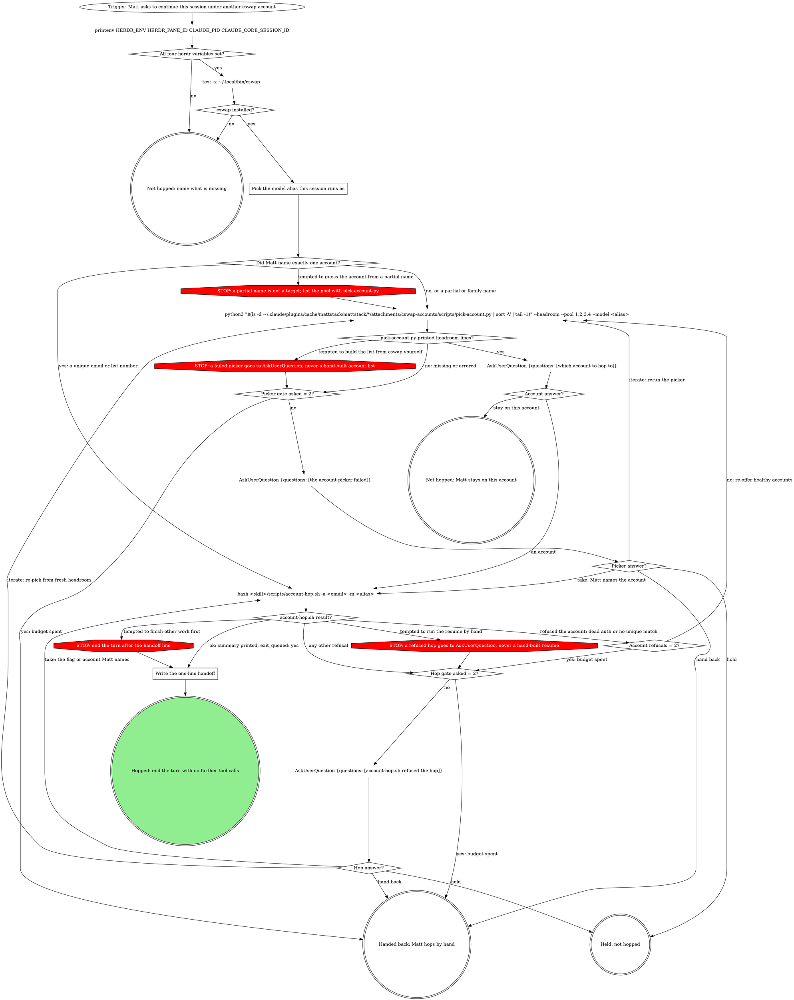

# account-hop

Hand this very session to another cswap account: split a pane right, park
a waiter there, exit this claude, and the waiter resumes the SAME session
id (no fork) under the target account with shared history. You are the
origin claude, running this from inside the session being hopped, in a
herdr pane.

`<skill>` is this skill's directory (the folder holding this file).

## The flow

Follow this graph. A move it does not show is a question for Matt through
AskUserQuestion, never a judgment call.

Counts never reset within one hop. Each gate's `asked = 2?` counter sits in
front of the gate because take loops back as well as iterate; a guard STOP
enters its gate through that counter too.

The two precondition checks read the environment herdr sets in every
claude pane and the cswap install; when either is missing, say which and
stop. "Set" means `HERDR_ENV` is exactly `1` and the other three
variables are non-empty; `HERDR_ENV=0` counts as not set.

### Pick the model alias this session runs as

Map the model you are running as right now to its CLI alias: fable, opus,
sonnet or haiku. A model Matt names wins. Always pass `-m`: without it the
resumed session silently runs on claude's default model.

## Did Matt name exactly one account?

A unique email or a list number is a name: skip the picker and hop. A
partial or family name ("bouncer", "my other account") is not, even when
you think you know which one he means: list the pool and ask, showing at
least the matching accounts.

## The account question

The picker's newest copy lives in the mattstack plugin cache; the graph's
call resolves it by version sort in the same command. One AskUserQuestion,
single choice: name the current account in the question sentence ("You
are on <email> now.") and leave it out of the options, so at most 3
accounts plus a last option **Stay on this account** ("I don't hop; this
session keeps going here.") stay under AskUserQuestion's 4-option cap.
Each account option carries its headroom line verbatim as the
description, with the healthiest non-current account first and
recommended. Never offer or recommend an account whose `cswap list
--json` row has `usageStatus` `relogin_required`, `no_credentials` or
`api_key`: a dead account fails only after this session has exited,
stranding Matt. Labels are 2 to 6 words (the email alone fits).

## The hop call

`bash <skill>/scripts/account-hop.sh -a <email> -m <alias>`

`-a` takes the email; when Matt named only a list number, pass that
number as given (the script resolves both numbers and emails, but
numbers can renumber, so prefer the email when it is known). Pane, pid
and session id come from the environment; the cwd is the shell's `$PWD`,
so add `-c <dir>` when the working directory has drifted from the session's
project dir. `-h` lists the rest (direction, timeout, no-exit, no-focus,
keep-origin-pane). The script resolves the account to exactly one row,
refuses a dead one ("is unusable (usageStatus=...)") or an unmatched one
("ambiguous" or "not an exact number/email"): those are account refusals.
Anything else it refuses (not inside herdr, origin pid not alive, cswap
list failed) is another refusal. On success it splits right, starts the
waiter and queues `/exit` into this pane; its summary ends with
`exit_queued: yes`.

### Write the one-line handoff

Write one short line: "resuming this session as <account> in the pane to
the right; exiting". Mention the folder-trust dialog only when hopping in
an unusual directory (the target profile may never have trusted it; Matt
answers it in the new pane). Then end the turn with no further tool calls
and no unfinished work picked back up: the queued `/exit` submits only
when the turn ends, and the waiter resumes only after this process dies.

## Gates

**The account picker failed.** Quote the error.

| Answer | Label | Description |
|--------|-------|-------------|
| take | I'll name the account | Your note names the account; I hop to it. |
| iterate | Rerun the picker | I run the account picker again. |
| hold | Hold the hop | I stop here; this session stays on this account. |
| hand back | I'll hop by hand | I stop and leave the hop to you. |

**account-hop.sh refused the hop.** Quote the refusal.

| Answer | Label | Description |
|--------|-------|-------------|
| take | Use my account or flag | I rerun the hop with the account or flag in your note. |
| iterate | Re-pick from fresh headroom | I rerun the picker and ask which account again. |
| hold | Hold the hop | I stop here; this session stays on this account. |
| hand back | I'll hop by hand | I stop; the waiter prints the manual resume command if one started. |

## Gotchas

- cswap forwards everything after the first `--` to the claude binary:
  `cswap run <acct> --share-history -- --resume <id> --model <m>`. Never a
  literal `claude` token after the `--`. The script builds this; never
  build it by hand.
- `--share-history` is mandatory: cswap re-syncs sharing every launch, and
  without it the target profile's history unlinks and `--resume` cannot
  see this transcript.
- No `--fork-session`: a same-id resume is safe because the waiter waits
  for the origin pid to die first.
- If the queued `/exit` is lost (a startup-greeting-style race), Matt
  exits by hand; the waiter still catches it, and after its timeout
  (default 300s) it prints the manual resume command.
- The resumed pane runs under the target account's plugin cache, so
  missing-plugin symptoms there are expected; do not chase them.
- Once the origin claude has exited, the waiter closes the origin pane;
  `-O` keeps it open instead. On waiter timeout the pane is left open
  either way.

## Rationalizations

| Thought | Reality |
|---------|---------|
| "'bouncer' obviously means claude@bouncer.mx." | A partial name is not a target. List the pool and ask. |
| "Matt said whatever it takes, so I'll build the resume command myself." | A refused hop goes to the hop gate; only `account-hop.sh` hops. |
| "The picker is missing, so I'll read `cswap list --json` and rank them myself." | A failed picker goes to the picker gate. |
| "I'll just commit these edits before I stop." | After the summary, one handoff line and the turn ends. The work continues in the resumed pane. |
| "`-m` is optional." | Omitting it resumes on the default model. |
| "the correct move is to restore the tool (via the already-established `/reload-plugins` path) rather than improvise around it." | The picker gate ("the account picker failed") asks Matt; restoring the tool on your own is not on the graph. |
