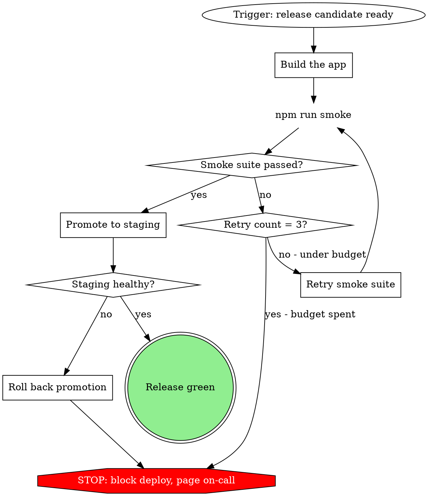

# Process Digraphs

A process digraph turns a skill's process into a state machine the model can execute without guessing. It goes in SKILL.md as a fenced ` ```dot ` block.

Core principle: **shape carries meaning, every branch is labeled, every loop is bounded, and it is not done until `dot` renders it.** "I mentally validated the syntax" is not verification... broken DOT reads fine until Graphviz parses it.

## When to use

- The skill documents a process with decisions, loops, or failure paths.
- You are reproducing a flow like superpowers subagent-driven-development.

Not for linear steps (use a numbered list), reference material (a table), or code (a code block). A flowchart earns its place only at non-obvious decision points and loops where an agent might stop too early.

## Shape vocabulary (the contract)

| Shape | Means | Phrase it as |
| --- | --- | --- |
| `diamond` | a decision | a question ending in `?` |
| `box` (default) | an action | start with a verb |
| `plaintext` | a literal command | the exact command text |
| `ellipse` | a state or trigger | describe the situation |
| `octagon` (red fill) | a STOP / hard warning | `STOP: ...` |
| `doublecircle` | entry / exit | the trigger or the outcome |

Two rules the shapes do not cover:

- **The node text IS the identity.** Write the full instruction as the quoted node name (`"Promote to staging"`), house style across the corpus. Do not use opaque ids with a separate label (`n1 [label="Promote to staging"]`) or generic ids (`step1`, `helper2`). Less bookkeeping, and it reads as a sentence.
- **Fill the success terminal** `[shape=doublecircle style=filled fillcolor=lightgreen]`. Let shape carry the rest of the meaning... no ad-hoc fonts or colors.

## Starter template (house style, renders clean)



One example carries every convention: `ellipse` trigger, `box` actions, `plaintext` command, `diamond` decisions, a **bounded** retry loop with a breaker (`Retry count = 3?`), an `octagon` STOP, and a green `doublecircle` terminal. Group a repeated sub-process in a `subgraph cluster_name { label="..."; ... }` when one exists (the "Per Task" box in subagent-driven-development).

## Recipe

1. Write the process as prose first: states, decision gates, loops, failure paths.
2. Map each to a node with the right shape. Give every decision a labeled out-edge for **every** outcome.
3. **Render it. Required.** For a loose file: `dot -Tsvg diagram.dot -o /tmp/d.svg` and open it. For a SKILL.md, run `./render.sh SKILL.md` (in this skill dir) to render every block and exit non-zero on any parse error. If `dot` is missing: `brew install graphviz`.
4. Run the design checklist below against the rendered picture.
5. Paste the ` ```dot ` block into SKILL.md.

## Design checklist

- Every `diamond` labels **all** its out-edges. A missing branch is behavior the model will improvise.
- Every loop is **bounded** or has a labeled escape. A poll-until or retry loop needs an "after N, escalate / STOP" exit, or it can spin forever (this is the trap).
- Each outcome has one clearly marked terminal; the success one is filled green.
- Node text is the instruction to follow, not `step1`. Commands are `plaintext` with the literal command.
- It actually rendered, with no Graphviz warnings.

## Common mistakes

| Mistake | Fix |
| --- | --- |
| Mentally validating instead of rendering | Run `dot`. A missing quote or stray edge only shows there. |
| Opaque ids + `label=` (`n1 [label=...]`) | Use the sentence as the node id. Matches the corpus, less bookkeeping. |
| Unbounded poll / retry loop | Add a counter and a breaker, or a labeled escape edge. |
| Ad-hoc fonts and fill colors | Let shape carry meaning; only the success terminal gets a fill. |
| Multi-line code inside a node | A command is a short `plaintext` node; real code belongs in a markdown block, not the graph. |
| Flowchart for linear steps | Use a numbered list instead. |

Mermaid is the alternative when the diagram must render inline on GitHub or in an artifact; this skill is for graphviz / dot, which gives cleaner auto-layout but only renders when someone runs `dot`.
